# GRX10 ERP — Core Schema (ERD)

15 core tables, generated 2026-04-28.

```mermaid
erDiagram
    organizations {
        UUID id PK
        TEXT name
        TEXT slug UK
        JSONB settings
        TIMESTAMPTZ created_at
        TIMESTAMPTZ updated_at
    }

    profiles {
        UUID id PK
        UUID user_id UK "FK auth.users"
        UUID organization_id FK
        UUID manager_id FK
        TEXT full_name
        TEXT email
        TEXT department
        TEXT job_title
        TEXT status
        DATE join_date
        TIMESTAMPTZ created_at
        TIMESTAMPTZ updated_at
    }

    user_roles {
        UUID id PK
        UUID user_id "FK auth.users"
        UUID organization_id FK
        TEXT role "admin|hr|manager|payroll|finance|employee"
        TIMESTAMPTZ created_at
    }

    invoices {
        UUID id PK
        UUID organization_id FK
        TEXT invoice_number
        TEXT client_name
        TEXT status
        NUMERIC amount
        DATE due_date
        TIMESTAMPTZ deleted_at
        TIMESTAMPTZ created_at
        TIMESTAMPTZ updated_at
    }

    bills {
        UUID id PK
        UUID organization_id FK
        UUID journal_entry_id FK
        TEXT bill_number
        TEXT status
        NUMERIC amount
        NUMERIC paid_amount
        DATE due_date
        TIMESTAMPTZ deleted_at
        TIMESTAMPTZ created_at
        TIMESTAMPTZ updated_at
    }

    journal_entries {
        UUID id PK
        UUID organization_id FK
        DATE entry_date
        TEXT memo
        TEXT source_type
        UUID source_id
        BOOLEAN is_posted
        BOOLEAN is_reversal
        UUID reversed_entry_id FK
        TIMESTAMPTZ created_at
    }

    journal_lines {
        UUID id PK
        UUID journal_entry_id FK
        UUID gl_account_id FK
        NUMERIC debit
        NUMERIC credit
        TEXT description
        TIMESTAMPTZ created_at
    }

    gl_accounts {
        UUID id PK
        UUID organization_id FK
        UUID parent_id FK
        TEXT code
        TEXT name
        TEXT account_type "asset|liability|equity|revenue|expense"
        BOOLEAN is_active
        BOOLEAN is_system
        TIMESTAMPTZ created_at
        TIMESTAMPTZ updated_at
    }

    payroll_runs {
        UUID id PK
        UUID organization_id FK
        TEXT pay_period
        TEXT status
        NUMERIC total_gross
        NUMERIC total_deductions
        NUMERIC total_net
        INTEGER employee_count
        TIMESTAMPTZ created_at
        TIMESTAMPTZ updated_at
    }

    payroll_entries {
        UUID id PK
        UUID payroll_run_id FK
        UUID profile_id FK
        UUID organization_id FK
        UUID compensation_structure_id FK
        NUMERIC annual_ctc
        NUMERIC gross_earnings
        NUMERIC total_deductions
        NUMERIC net_pay
        INTEGER lwp_days
        JSONB earnings_breakdown
        JSONB deductions_breakdown
        TEXT status "computed|approved|locked"
        TIMESTAMPTZ created_at
        TIMESTAMPTZ updated_at
    }

    payroll_records {
        UUID id PK
        UUID profile_id FK
        UUID organization_id FK
        TEXT pay_period
        NUMERIC net_pay
        TEXT status "draft|completed|approved|superseded"
        BOOLEAN is_superseded
        TIMESTAMPTZ created_at
        TIMESTAMPTZ updated_at
    }

    leave_requests {
        UUID id PK
        UUID profile_id FK
        UUID organization_id FK
        TEXT leave_type
        DATE from_date
        DATE to_date
        INTEGER days
        TEXT status "pending|approved|rejected|cancelled"
        TIMESTAMPTZ created_at
        TIMESTAMPTZ updated_at
    }

    attendance_records {
        UUID id PK
        UUID profile_id FK
        UUID organization_id FK
        DATE date
        TIMESTAMPTZ check_in
        TIMESTAMPTZ check_out
        TEXT status
        TIMESTAMPTZ created_at
        TIMESTAMPTZ updated_at
    }

    expenses {
        UUID id PK
        UUID organization_id FK
        UUID profile_id FK
        TEXT category
        NUMERIC amount
        DATE expense_date
        TEXT status
        TIMESTAMPTZ deleted_at
        TIMESTAMPTZ created_at
        TIMESTAMPTZ updated_at
    }

    compensation_structures {
        UUID id PK
        UUID profile_id FK
        UUID organization_id FK
        NUMERIC annual_ctc
        DATE effective_from
        DATE effective_to
        BOOLEAN is_active
        INTEGER revision_number
        TIMESTAMPTZ created_at
        TIMESTAMPTZ updated_at
    }

    organizations ||--o{ profiles : "has"
    organizations ||--o{ user_roles : "has"
    organizations ||--o{ invoices : "has"
    organizations ||--o{ bills : "has"
    organizations ||--o{ journal_entries : "has"
    organizations ||--o{ gl_accounts : "has"
    organizations ||--o{ payroll_runs : "has"
    organizations ||--o{ payroll_entries : "has"
    organizations ||--o{ payroll_records : "has"
    organizations ||--o{ leave_requests : "has"
    organizations ||--o{ attendance_records : "has"
    organizations ||--o{ expenses : "has"
    organizations ||--o{ compensation_structures : "has"

    profiles ||--o{ payroll_entries : "receives"
    profiles ||--o{ payroll_records : "receives"
    profiles ||--o{ leave_requests : "submits"
    profiles ||--o{ attendance_records : "has"
    profiles ||--o{ expenses : "claims"
    profiles ||--o{ compensation_structures : "has"
    profiles }o--o| profiles : "manager_id"

    journal_entries ||--o{ journal_lines : "contains"
    journal_entries }o--o| journal_entries : "reversal_of"
    bills }o--o| journal_entries : "posted via"

    gl_accounts ||--o{ journal_lines : "debited/credited in"
    gl_accounts }o--o| gl_accounts : "parent_id"

    payroll_runs ||--o{ payroll_entries : "contains"
    compensation_structures ||--o{ payroll_entries : "defines salary for"
```

## Architecture Notes

- **Dual payroll paths**: `payroll_records` (legacy flat columns) and `payroll_runs` + `payroll_entries` (engine, JSON breakdowns). Both normalize to `NormalizedPayslip` via `normalizePayslip()`.
- **GL canonical**: `gl_accounts` is the single source of truth. `chart_of_accounts` is deprecated.
- **Soft delete pattern**: bills, invoices, expenses use `deleted_at` TIMESTAMPTZ.
- **Org isolation**: every table has `organization_id` with RLS enforced via Supabase policies.
- **financial_records**: sync-derived from `journal_lines` via `trg_sync_financial_records` — do not write directly.
